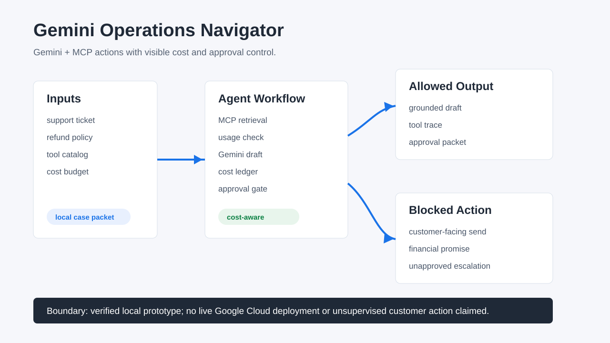
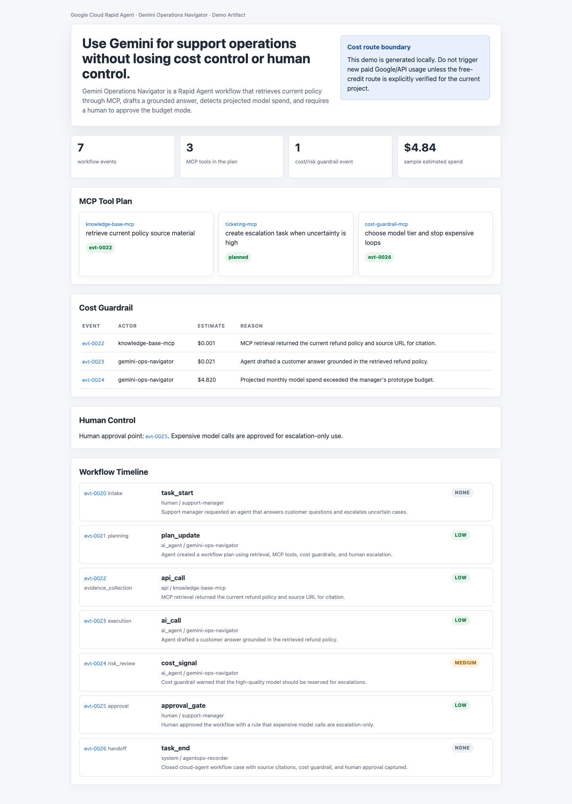
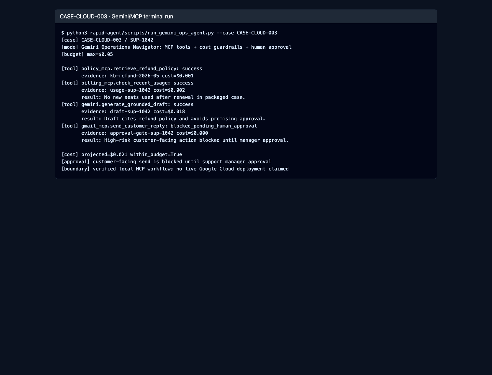

# Gemini Operations Navigator

Gemini + MCP for support operations managers who need evidence-backed AI drafts, visible cost guardrails, and human approval before customer-facing action.

Live demo: https://daideguchi.github.io/gemini-operations-navigator/

YouTube demo: https://www.youtube.com/watch?v=kt34TmPsT4g

Submission package: [SUBMISSION_PACKAGE.md](SUBMISSION_PACKAGE.md)

Architecture: [ARCHITECTURE.md](ARCHITECTURE.md)

Devpost field copy: [rapid-agent/submission/devpost-submit-manual.md](rapid-agent/submission/devpost-submit-manual.md)

## Credit And Cost Boundary

Devpost sent an update on 2026-05-30 JST saying the hackathon-issued `$100 Google Cloud credit codes` for Google Cloud Rapid Agent Hackathon are no longer available because the pool was exhausted. The standard Google Cloud free trial remains a supported submission path.

This project must therefore stay on no-out-of-pocket routes only. Do not assume a `$100` hackathon credit code will arrive, and do not use paid upgrades, prepay credits, auto-reload, or payment confirmation flows.

## Judge Quick Read

**Who is this for?** Support operations managers handling refund and escalation queues.

**What problem does it solve?** AI support agents become risky when the manager cannot see which tools were used, what evidence was cited, how much the run may cost, and whether a refund promise is about to be sent.

**How does it use AI?** Gemini drafts from policy evidence, MCP tools retrieve and verify context, Arize Phoenix MCP exposes trace tooling, and the workflow blocks the customer reply until a human manager approves it.

**What is verified?** A terminal run, MCP tool trace, Arize/OpenInference-compatible span trace, cost ledger, approval checkpoint, Agent Builder-ready runtime manifest, actual Phoenix MCP stdio handshake, current Vertex rerun status, workflow UI, architecture diagram, narrated demo video, and public GitHub Pages review hub.

## Demo







Demo video:

```text
https://www.youtube.com/watch?v=kt34TmPsT4g
rapid-agent/media/gemini-operations-navigator-demo.mp4
```

Open in browser:

- https://daideguchi.github.io/gemini-operations-navigator/
- https://daideguchi.github.io/gemini-operations-navigator/rapid-agent/prototype/gemini-operations-navigator.html
- https://daideguchi.github.io/gemini-operations-navigator/rapid-agent/prototype/terminal-session.html

## Run Locally

```bash
cd /path/to/gemini-operations-navigator
bash rapid-agent/scripts/run_google_local_checks.sh
```

Expected proof:

```text
google_local_checks_ok
mcp_tool_calls=4
projected_cost_usd=0.021
cost_within_budget=True
human_approval_required=true
openinference_spans=4
partner_track=Arize
vertex_status=blocked_by_google_cloud_account_state
phoenix_mcp_tool_count=27
agent_builder_manifest=present
claim_boundary=local_workflow_verified_phoenix_mcp_verified_vertex_rerun_blocked_if_google_consumer_suspended_no_customer_send_claim
```

## What It Shows

- MCP-style tool calls for policy, usage, draft, and customer reply.
- A grounded Gemini-style reply that cites evidence instead of promising a refund.
- A cost ledger that keeps projected spend visible.
- An Arize/OpenInference-compatible trace for every tool step, evidence ID, cost estimate, and approval boundary.
- A real Phoenix MCP server launch over stdio with `initialize` and `tools/list` proof.
- An Agent Builder-ready manifest for model, tools, MCP, budget, and approval policy.
- A current Vertex AI rerun report. If Google Cloud reports the project consumer is suspended, the project records that stopline instead of claiming a live generation.
- A high-risk customer-facing send blocked until manager approval.

## Key Files

- `rapid-agent/case_data/` - support ticket, policy excerpt, and tool catalog.
- `rapid-agent/scripts/run_gemini_ops_agent.py` - terminal workflow.
- `rapid-agent/reports/mcp-tool-trace.jsonl` - replayable tool trace.
- `rapid-agent/reports/openinference-trace.jsonl` - Arize/OpenInference-compatible span trace.
- `rapid-agent/reports/cost-ledger.json` - budget and projected cost.
- `rapid-agent/reports/approval-checkpoint.md` - human approval packet.
- `rapid-agent/reports/vertex-gemini-live-proof.json` - current Vertex AI Gemini rerun status.
- `rapid-agent/reports/phoenix-mcp-runtime-proof.json` - actual Phoenix MCP server handshake and tool list.
- `rapid-agent/agent-builder/agent-builder-runtime-manifest.json` - Agent Builder-ready runtime package.
- `rapid-agent/prototype/terminal-session.html` - terminal proof page.
- `ARCHITECTURE.md` - component and data-flow explanation.

## Claim Boundary

Safe claim:

- A local Gemini/MCP workflow prototype runs against packaged case data and produces tool trace, cost ledger, approval checkpoint, workflow UI, Phoenix MCP runtime proof, Agent Builder-ready manifest, and natural English demo video.
- The current Google Cloud Vertex rerun status is recorded in `rapid-agent/reports/vertex-gemini-live-proof.json`.

Not claimed yet:

- Production Google Cloud deployment.
- Final promotional-credit accounting.
- Unsupervised customer-facing action.
